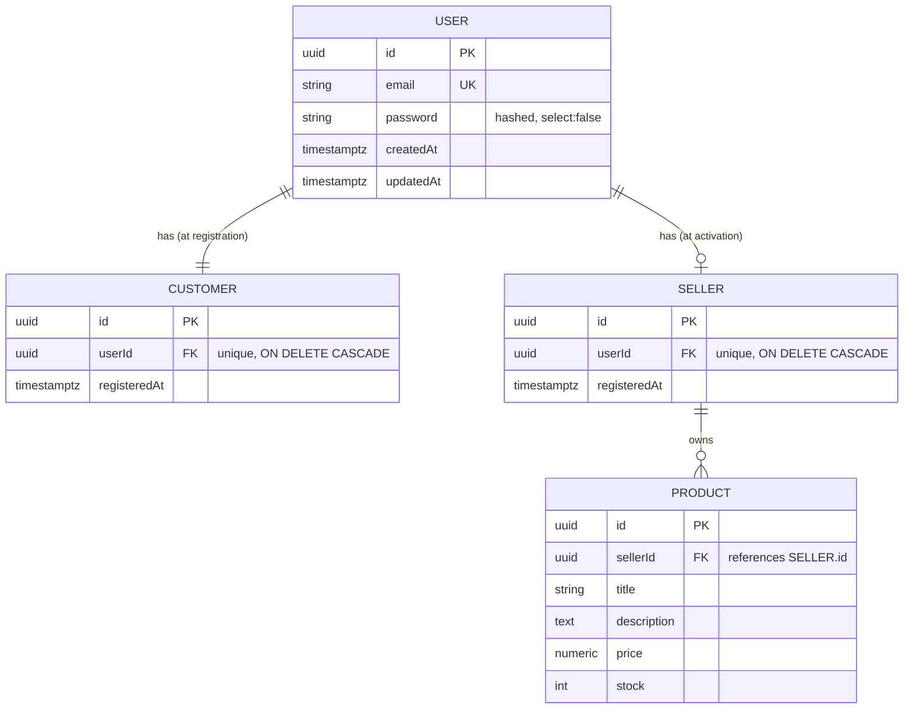

<h1 align="center">🛒 Dual-Role Marketplace API</h1>

<p align="center">
  A production-shaped <strong>NestJS</strong> e-commerce backend where every account is a <strong>Customer</strong> by default and can <strong>activate a Seller</strong> profile on demand — with ACID-safe onboarding, JWT role claims, and ownership-scoped data access.
</p>

<p align="center">
  
  
  
  
  
</p>

---

## ✨ Highlights

- **Hybrid-start identity** — one centralized `User` table; `Customer` and `Seller` are separate role tables linked 1:1 back to the user.
- **ACID registration** — `User` + `Customer` are created inside a single transaction. If anything fails, the whole thing rolls back — **no orphaned records, ever**.
- **Self-service seller activation** — any user can activate a shop via one endpoint, which **re-issues a fresh JWT** containing the new `sellerId` so the client swaps tokens instantly (no logout/login).
- **Ownership-scoped writes** — sellers can only update/delete *their own* products. Cross-seller tampering is impossible by query design.
- **Keyset (cursor) pagination** — stable, O(limit) catalog paging that doesn't skip or duplicate rows under concurrent writes.
- **Consistent API envelope** — every success/fail/error response follows one predictable shape.

---

## 🏗️ Architecture

### Identity model

A single `User` row is the source of truth for authentication. Role-specific data lives in dedicated tables that each own a **unique** foreign key back to the user. A user is **always** a customer (provisioned at registration) and **optionally** a seller (provisioned at activation).



> ⚠️ **Key detail:** `Product.sellerId` references the **`seller` table id**, *not* the `user` id. Every ownership check is keyed on `sellerId`.

### Modules (folder-by-feature)

| Module | Responsibility |
|---|---|
| **`auth`** | Registration (transactional), login, JWT issuance, `JwtAuthGuard`, `SellerGuard`, `@CurrentUser()` |
| **`users`** | Central `User` entity + identity lookups (incl. password-with-hash query) |
| **`customers`** | `Customer` entity + transactional provisioning |
| **`sellers`** | `Seller` entity + activation flow (with token refresh) |
| **`products`** | `Product` entity, customer (public) + seller (owned) controllers, pagination |
| **`common`** | Response envelope interceptor & global exception filter |

```
src/
├── auth/
│   ├── decorators/current-user.decorator.ts
│   ├── dto/                     # register, login
│   ├── guards/                  # jwt-auth.guard, seller.guard
│   ├── interfaces/              # JwtPayload, AuthenticatedUser
│   ├── auth.controller.ts       # /auth/v1
│   ├── auth.service.ts          # transaction + token issuance
│   └── auth.module.ts
├── users/        (entity, service, module)
├── customers/    (entity, service, module)
├── sellers/
│   ├── sellers.controller.ts    # /sellers/v1/activate
│   └── ...
├── products/
│   ├── customer-products.controller.ts   # /customers/v1/products (+ ?categoryId)
│   ├── seller-products.controller.ts     # /sellers/v1/products
│   ├── dto/                     # create, update, pagination, catalog-query
│   └── products.service.ts      # keyset pagination + ownership checks
├── categories/
│   ├── admin-categories.controller.ts    # /admin/categories (CRUD)
│   ├── customer-categories.controller.ts # /customers/v1/categories (read)
│   └── categories.service.ts    # slug + parent-cycle validation
├── common/       (filters, interceptors, dto, slugify)
├── types/        express.d.ts   # types request.user
├── app.module.ts                # ConfigModule + TypeOrmModule wiring
└── main.ts                      # global ValidationPipe + exception filter
```

---

## 🔐 Authentication & role flow

```
1. POST /auth/v1/register   ──►  Transaction { create User + create Customer }
2. POST /auth/v1/login      ──►  JWT { sub, email, customerId, sellerId:null }
3. POST /sellers/v1/activate ─►  create Seller  +  NEW JWT { ..., sellerId }
4. Seller routes            ──►  JwtAuthGuard → SellerGuard (403 if sellerId is null)
```

**JWT payload**

```jsonc
{
  "sub": "<userId>",
  "email": "user@example.com",
  "customerId": "<customerId>",   // always present after registration
  "sellerId": "<sellerId> | null" // null until the shop is activated
}
```

The activation endpoint returns a **brand-new token** carrying the freshly minted `sellerId`, so the frontend can swap the stored token in place — no re-login required.

---

## 📡 API reference

All responses are wrapped in a standard envelope (see [Response format](#-response-format)). Protected routes require `Authorization: Bearer <token>`.

### Auth — `auth/v1`

| Method | Endpoint | Auth | Description |
|---|---|---|---|
| `POST` | `/auth/v1/register` | — | Create user + customer (transactional) |
| `POST` | `/auth/v1/login` | — | Verify credentials, return JWT |

### Sellers — `sellers/v1`

| Method | Endpoint | Auth | Description |
|---|---|---|---|
| `POST` | `/sellers/v1/activate` | JWT | Activate seller profile, return **refreshed** JWT |

### Customer catalog — `customers/v1`

| Method | Endpoint | Auth | Description |
|---|---|---|---|
| `GET` | `/customers/v1/products` | — | List active products (keyset paginated); filter with `?categoryId=` |
| `GET` | `/customers/v1/products/:id` | — | Get a single product |
| `GET` | `/customers/v1/categories` | — | List all categories (for nav / filter discovery) |
| `GET` | `/customers/v1/categories/:id` | — | Get a single category |

### Seller products — `sellers/v1`

| Method | Endpoint | Auth | Description |
|---|---|---|---|
| `GET` | `/sellers/v1/products` | JWT + Seller | List **only** the caller's products |
| `POST` | `/sellers/v1/products` | JWT + Seller | Create a product (bound to caller's `sellerId`; optional `categoryId`) |
| `PUT` | `/sellers/v1/products/:id` | JWT + Seller | Update — **ownership-scoped** (optional `categoryId`) |
| `DELETE` | `/sellers/v1/products/:id` | JWT + Seller | Delete — **ownership-scoped** |

### Categories (admin) — `admin/categories`

Categories are a shared reference set (a shallow tree), so they are admin-managed rather than seller-scoped. Slugs are auto-generated from the name and stay stable across renames.

| Method | Endpoint | Auth | Description |
|---|---|---|---|
| `GET` | `/admin/categories` | JWT + Admin | List all categories |
| `GET` | `/admin/categories/:id` | JWT + Admin | Get a single category |
| `POST` | `/admin/categories` | JWT + Admin | Create (optional `parentId`) |
| `PATCH` | `/admin/categories/:id` | JWT + Admin | Update name / reparent (`parentId: null` detaches) |
| `DELETE` | `/admin/categories/:id` | JWT + Admin | Delete (products are `SET NULL` out of it) |

### Example requests

<details>
<summary><strong>Register</strong></summary>

```bash
curl -X POST http://localhost:3000/auth/v1/register \
  -H "Content-Type: application/json" \
  -d '{ "email": "ada@example.com", "password": "supersecret" }'
```
```json
{ "status": "success", "data": { "id": "…", "email": "ada@example.com", "customerId": "…" } }
```
</details>

<details>
<summary><strong>Login</strong></summary>

```bash
curl -X POST http://localhost:3000/auth/v1/login \
  -H "Content-Type: application/json" \
  -d '{ "email": "ada@example.com", "password": "supersecret" }'
```
```json
{ "status": "success", "data": { "accessToken": "eyJ…", "customerId": "…", "sellerId": null } }
```
</details>

<details>
<summary><strong>Activate seller (returns a new token)</strong></summary>

```bash
curl -X POST http://localhost:3000/sellers/v1/activate \
  -H "Authorization: Bearer <token>"
```
```json
{ "status": "success", "data": { "accessToken": "eyJ…", "customerId": "…", "sellerId": "…" } }
```
</details>

<details>
<summary><strong>Create a product</strong></summary>

```bash
curl -X POST http://localhost:3000/sellers/v1/products \
  -H "Authorization: Bearer <seller-token>" \
  -H "Content-Type: application/json" \
  -d '{ "title": "Mechanical Keyboard", "description": "Hot-swap, 75%", "price": 129.99, "stock": 40 }'
```
</details>

<details>
<summary><strong>Browse catalog (keyset pagination)</strong></summary>

```bash
curl "http://localhost:3000/customers/v1/products?limit=20"
# → use data.nextCursor for the next page:
curl "http://localhost:3000/customers/v1/products?limit=20&cursor=<nextCursor>"
```
```json
{ "status": "success", "data": { "items": [ /* … */ ], "nextCursor": "eyJ…" | null } }
```
</details>

<details>
<summary><strong>Create a category & filter the catalog by it</strong></summary>

```bash
# Admin creates a category
curl -X POST http://localhost:3000/admin/categories \
  -H "Authorization: Bearer <admin-token>" \
  -H "Content-Type: application/json" \
  -d '{ "name": "Electronics" }'
# → { "status": "success", "data": { "id": "<categoryId>", "slug": "electronics", … } }

# Seller assigns it to a product (on create or update)
curl -X PUT http://localhost:3000/sellers/v1/products/<productId> \
  -H "Authorization: Bearer <seller-token>" \
  -H "Content-Type: application/json" \
  -d '{ "categoryId": "<categoryId>" }'

# Customer filters the public catalog by category
curl "http://localhost:3000/customers/v1/products?categoryId=<categoryId>&limit=20"
```
</details>

---

## 📦 Response format

Every response — success or failure — uses a consistent envelope, applied via a global interceptor and exception filter.

```jsonc
// Success
{ "status": "success", "data": { /* payload */ } }

// Client error (4xx) — validation, auth, not found, etc.
{ "status": "fail", "message": "…", "errors": ["…"] }

// Server error (5xx)
{ "status": "error", "message": "Internal server error" }
```

---

## 🛡️ Security model

- **Passwords** hashed with **bcrypt** (cost 12); the hash column is `select: false` and only loaded for login.
- **`JwtAuthGuard`** verifies the bearer token and attaches a typed `AuthenticatedUser` to `request.user`.
- **`SellerGuard`** rejects with **403** if `sellerId` is null — guaranteeing seller handlers always run with an active shop.
- **Ownership enforcement** — mutations use a compound key so a foreign id simply matches **zero rows → 404**:
  ```ts
  // Seller A can never touch Seller B's product
  this.productRepository.update({ id, sellerId: loggedInSellerId }, dto);
  this.productRepository.delete({ id, sellerId: loggedInSellerId });
  ```
- **Global `ValidationPipe`** with `whitelist` + `forbidNonWhitelisted` + `transform` strips/rejects unknown fields.

---

## 🚀 Getting started

### Prerequisites

- **Node.js** 18+
- **PostgreSQL** 13+ (a database must exist; tables are auto-created in dev)

### 1. Install

```bash
npm install
```

### 2. Configure environment

Copy the example and fill in your values:

```bash
cp .env.example .env
```

| Variable | Description | Example |
|---|---|---|
| `PORT` | HTTP port | `3000` |
| `DB_HOST` / `DB_PORT` | PostgreSQL host & port | `localhost` / `5432` |
| `DB_USERNAME` / `DB_PASSWORD` | DB credentials | `postgres` / `***` |
| `DB_NAME` | Database name (**must already exist**) | `ecommerce_db` |
| `DB_SYNCHRONIZE` | Auto-create schema from entities (**dev only**) | `true` |
| `DB_LOGGING` | Log SQL | `false` |
| `JWT_SECRET` | Signing secret (use a long random string) | `***` |
| `JWT_EXPIRES_IN` | Token TTL | `1d` |
| `REDIS_*` | Redis (reserved for caching/queues) | — |
| `MINIO_*` | MinIO/S3 (reserved for product images) | — |

> 💡 The app does **not** create the database itself — only its tables. Create the DB once:
> ```sql
> CREATE DATABASE ecommerce_db;
> ```

### 3. Run

```bash
npm run start:dev     # watch mode
npm run start         # plain
npm run start:prod    # from compiled dist/
```

With `DB_SYNCHRONIZE=true`, the `user`, `customer`, `seller`, and `product` tables are created automatically on first boot.

---

## 🧰 Tech stack

| Concern | Choice |
|---|---|
| Framework | NestJS 11 |
| Language | TypeScript 5.7 |
| ORM | TypeORM 0.3 |
| Database | PostgreSQL |
| Auth | `@nestjs/jwt` + custom guards |
| Hashing | bcrypt |
| Validation | class-validator / class-transformer |
| Config | `@nestjs/config` |

---

## 🧪 Tests

```bash
npm run test          # unit
npm run test:e2e      # end-to-end
npm run test:cov      # coverage
```

---

## 🗺️ Roadmap

- [ ] Refresh-token rotation & token revocation
- [ ] Redis-backed caching for the public catalog
- [ ] MinIO/S3 product image uploads (env already provisioned)
- [ ] Orders & checkout domain
- [ ] TypeORM migrations (replace `synchronize` in production)
- [ ] OpenAPI/Swagger documentation

---

## 📄 License

UNLICENSED — private project.
