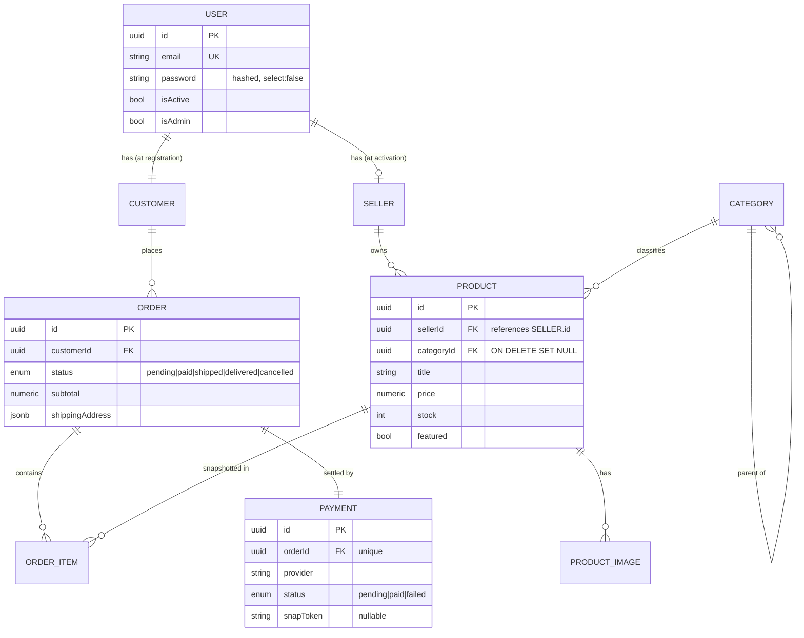

<h1 align="center">🛒 Dual-Role Marketplace API</h1>

<p align="center">
  A production-shaped <strong>NestJS</strong> e-commerce backend where every account is a <strong>Customer</strong> by default and can <strong>activate a Seller</strong> profile on demand — with ACID-safe onboarding, JWT role claims, ownership-scoped data access, server-priced checkout, and a pluggable payment gateway.
</p>

<p align="center">
  
  
  
  
  
  
  
  
</p>

---

## ✨ Highlights

- **Hybrid-start identity** — one centralized `User` table; `Customer` and `Seller` are separate role tables linked 1:1 back to the user.
- **ACID registration** — `User` + `Customer` are created inside a single transaction. If anything fails, the whole thing rolls back — **no orphaned records, ever**.
- **Self-service seller activation** — any user can activate a shop via one endpoint, which **re-issues a fresh JWT** containing the new `sellerId` so the client swaps tokens instantly (no logout/login).
- **Ownership-scoped writes** — sellers can only update/delete *their own* products. Cross-seller tampering is impossible by query design.
- **Server-priced checkout** — orders are **re-priced from the catalog** (client prices are never trusted), placed under a **pessimistic write lock** that prevents overselling, with descriptive `400`/`409` failures.
- **Pluggable payments** — a `PaymentProvider` interface with a **mock gateway (default, offline)** and a real **Midtrans Snap** provider, chosen via `PAYMENT_PROVIDER`. A signature-verified public webhook settles orders idempotently.
- **Image pipeline** — presigned **S3/MinIO** uploads with a confirm step; the public catalog serves a `primaryImage` on lists and full `images[]` on detail.
- **Category tree with descendant rollup** — filtering by a top-level category returns products from all of its descendants.
- **Redis-backed catalog cache** — list + detail pages are cached with versioned keys and **fail open** if Redis is unavailable.
- **Keyset (cursor) pagination** — stable, O(limit) paging that doesn't skip or duplicate rows under concurrent writes.
- **Typed OpenAPI** — response DTOs drive a complete schema at `/docs`.
- **Consistent API envelope** — every success/fail/error response follows one predictable shape.

---

## 🏗️ Architecture

### Identity & domain model

A single `User` row is the source of truth for authentication. Role-specific data lives in dedicated tables that each own a **unique** foreign key back to the user. A user is **always** a customer (provisioned at registration) and **optionally** a seller (provisioned at activation). Products carry images and a category; checkout produces orders, order items, and a payment.



> ⚠️ **Key detail:** `Product.sellerId` references the **`seller` table id**, *not* the `user` id. Every ownership check is keyed on `sellerId`. Likewise `Order.customerId` scopes every order read/write.

### Modules (folder-by-feature)

| Module | Responsibility |
|---|---|
| **`auth`** | Registration (transactional), login, JWT issuance (`expiresIn`), `JwtAuthGuard`, `SellerGuard`, `AdminGuard`, `@CurrentUser()` |
| **`users`** | Central `User` entity, identity lookups, admin user management (list, deactivate, grant role) |
| **`customers`** | `Customer` entity + profile (`/me`) and avatar uploads |
| **`sellers`** | `Seller` entity, activation (token refresh), shop profile + logo uploads |
| **`products`** | `Product` + `ProductImage`, customer (public) + seller (owned) controllers, keyset pagination, sort/search/featured |
| **`categories`** | Category tree, slug + parent-cycle validation, descendant rollup, admin CRUD + public read |
| **`orders`** | Server-priced checkout, oversell-safe placement, order history (owner-scoped) |
| **`payments`** | `PaymentProvider` abstraction (mock + Midtrans), signature-verified webhook, order settlement |
| **`storage`** | S3/MinIO client, presigned PUT URLs, public URL resolution |
| **`cache`** | Redis-backed catalog cache with versioned keys (fails open) |
| **`common`** | Response envelope interceptor, global exception filter, shared transformers/helpers |

```
src/
├── auth/            decorators, dto, guards (jwt/seller/admin), interfaces, controller, service
├── users/           entity, admin-users.controller (/admin/users), service
├── customers/       entity, customers.controller (/customers/v1/me + avatar), me-response.dto
├── sellers/         entity, sellers.controller (/sellers/v1 activate + me + logo)
├── products/
│   ├── customer-products.controller.ts   # /customers/v1/products (+ filters, by-slug)
│   ├── seller-products.controller.ts     # /sellers/v1/products (+ publish, images)
│   ├── dto/                               # create, update, pagination, catalog-query, responses
│   ├── product-images.service.ts
│   └── products.service.ts                # keyset pagination + ownership + cache
├── categories/      admin + customer controllers, categories.service (tree, slug, rollup)
├── orders/          customer-orders.controller, orders.service, entities (order, order-item), dto
├── payments/        payments.controller (/payments/v1/webhook), payment.service, providers/
├── storage/         storage.service (presign + publicUrl), module
├── cache/           catalog-cache.service, module
├── database/        data-source.ts + migrations/
├── common/          filters, interceptors, dto, numeric.transformer, coerce, slugify
├── app.module.ts                         # ConfigModule + TypeOrmModule + global modules
└── main.ts                               # global ValidationPipe + exception filter + Swagger
```

---

## 🔐 Authentication & role flow

```
1. POST /auth/v1/register    ──►  Transaction { create User + create Customer }
2. POST /auth/v1/login       ──►  JWT { sub, email, customerId, sellerId:null, isAdmin } + expiresIn
3. POST /sellers/v1/activate ──►  create Seller  +  NEW JWT { ..., sellerId }
4. Seller routes             ──►  JwtAuthGuard → SellerGuard (403 if sellerId is null)
5. Admin routes              ──►  JwtAuthGuard → AdminGuard  (403 if isAdmin is false)
```

**JWT payload**

```jsonc
{
  "sub": "<userId>",
  "email": "user@example.com",
  "customerId": "<customerId>",   // always present after registration
  "sellerId": "<sellerId> | null", // null until the shop is activated
  "isAdmin": false
}
```

The activation endpoint returns a **brand-new token** carrying the freshly minted `sellerId`, so the frontend can swap the stored token in place — no re-login required. Login responses also include `expiresIn` (seconds, derived from the token's own `exp - iat`) for stateless client-side expiry handling.

---

## 📡 API reference

All responses are wrapped in a standard envelope (see [Response format](#-response-format)). Protected routes require `Authorization: Bearer <token>`. Full, typed schemas are browsable at **`/docs`** (OpenAPI/Swagger).

### Auth — `auth/v1`

| Method | Endpoint | Auth | Description |
|---|---|---|---|
| `POST` | `/auth/v1/register` | — | Create user + customer (transactional) |
| `POST` | `/auth/v1/login` | — | Verify credentials, return JWT + `expiresIn` |

### Customer profile — `customers/v1/me`

| Method | Endpoint | Auth | Description |
|---|---|---|---|
| `GET` | `/customers/v1/me` | JWT | Typed profile (`id, email, customerId, fullName, …`) |
| `PATCH` | `/customers/v1/me` | JWT | Update profile fields |
| `POST` | `/customers/v1/me/avatar/presign` | JWT | Get a presigned S3/MinIO PUT URL |
| `POST` | `/customers/v1/me/avatar` | JWT | Confirm the uploaded avatar object |
| `DELETE` | `/customers/v1/me/avatar` | JWT | Remove the avatar |

### Sellers — `sellers/v1`

| Method | Endpoint | Auth | Description |
|---|---|---|---|
| `POST` | `/sellers/v1/activate` | JWT | Activate seller profile, return **refreshed** JWT |
| `GET` / `PATCH` | `/sellers/v1/me` | JWT + Seller | Read / update shop profile |
| `POST` `DELETE` | `/sellers/v1/me/logo[/presign]` | JWT + Seller | Presign / confirm / delete shop logo |

### Customer catalog — `customers/v1`

| Method | Endpoint | Auth | Description |
|---|---|---|---|
| `GET` | `/customers/v1/products` | — | List active products (keyset paginated). Filters: `?categoryId=` (rolls up descendants), `?q=`, `?featured=true`, `?sort=newest\|price_asc\|price_desc` |
| `GET` | `/customers/v1/products/:id` | — | Product detail (full `images[]` + `primaryImage`) |
| `GET` | `/customers/v1/products/by-slug/:slug` | — | Product detail by SEO slug |
| `GET` | `/customers/v1/categories` | — | List all categories (nav / filter discovery) |
| `GET` | `/customers/v1/categories/:id` | — | Category with direct `children[]` |
| `GET` | `/customers/v1/categories/by-slug/:slug` | — | Category by SEO slug |

### Orders & checkout — `customers/v1/orders`

| Method | Endpoint | Auth | Description |
|---|---|---|---|
| `POST` | `/customers/v1/orders` | JWT | Place an order — **server-priced**, oversell-safe; returns `201` with a `payment` (snapToken/redirectUrl) |
| `GET` | `/customers/v1/orders` | JWT | Order history (keyset, newest first, owner-scoped) |
| `GET` | `/customers/v1/orders/:id` | JWT | Order detail (`404` if not owned) |

### Payments — `payments/v1`

| Method | Endpoint | Auth | Description |
|---|---|---|---|
| `POST` | `/payments/v1/webhook` | Provider signature | Settle an order idempotently. Mock verifies `X-Mock-Signature`; Midtrans recomputes the `signature_key` |

### Seller products — `sellers/v1/products`

| Method | Endpoint | Auth | Description |
|---|---|---|---|
| `GET` | `/sellers/v1/products` | JWT + Seller | List **only** the caller's products |
| `POST` | `/sellers/v1/products` | JWT + Seller | Create a product (bound to caller's `sellerId`; `categoryId` required) |
| `PUT` | `/sellers/v1/products/:id` | JWT + Seller | Update — **ownership-scoped** |
| `POST` | `/sellers/v1/products/:id/publish` · `/unpublish` | JWT + Seller | Toggle catalog visibility |
| `DELETE` | `/sellers/v1/products/:id` | JWT + Seller | Delete — **ownership-scoped** |
| `POST` | `/sellers/v1/products/:id/images/presign` · `/images` | JWT + Seller | Presign + confirm an uploaded image |
| `GET` `DELETE` | `/sellers/v1/products/:id/images[/:imageId]` | JWT + Seller | List / remove product images |

### Categories (admin) — `admin/categories`

Categories are a shared reference set (a shallow tree), so they are admin-managed. Slugs are auto-generated and stay stable across renames.

| Method | Endpoint | Auth | Description |
|---|---|---|---|
| `GET` | `/admin/categories[/:id]` | JWT + Admin | List / get categories |
| `POST` | `/admin/categories` | JWT + Admin | Create (optional `parentId`) |
| `PATCH` | `/admin/categories/:id` | JWT + Admin | Update name / reparent (`parentId: null` detaches) |
| `DELETE` | `/admin/categories/:id` | JWT + Admin | Delete (products are `SET NULL` out of it) |

### Users (admin) — `admin/users`

| Method | Endpoint | Auth | Description |
|---|---|---|---|
| `GET` | `/admin/users[/:id]` | JWT + Admin | List / get users |
| `PATCH` | `/admin/users/:id/deactivate` | JWT + Admin | Deactivate an account |
| `PATCH` | `/admin/users/:id/role` | JWT + Admin | Grant / revoke admin |

### Example requests

<details>
<summary><strong>Login (returns expiresIn)</strong></summary>

```bash
curl -X POST http://localhost:3000/auth/v1/login \
  -H "Content-Type: application/json" \
  -d '{ "email": "ada@example.com", "password": "supersecret" }'
```
```json
{ "status": "success", "data": { "accessToken": "eyJ…", "expiresIn": 86400, "customerId": "…", "sellerId": null } }
```
</details>

<details>
<summary><strong>Browse catalog (sort / search / featured / keyset)</strong></summary>

```bash
curl "http://localhost:3000/customers/v1/products?limit=20&sort=price_asc&q=laptop&featured=true"
# → use data.nextCursor for the next page
```
```json
{ "status": "success", "data": { "items": [ { "id": "…", "title": "…", "price": 1299, "primaryImage": { "url": "https://…", "width": 1200, "height": 1200 } } ], "nextCursor": "eyJ…" } }
```
</details>

<details>
<summary><strong>Place an order (server re-prices; mock payment)</strong></summary>

```bash
curl -X POST http://localhost:3000/customers/v1/orders \
  -H "Authorization: Bearer <token>" \
  -H "Content-Type: application/json" \
  -d '{
        "items": [ { "productId": "<id>", "quantity": 2 } ],
        "email": "ada@example.com",
        "shippingAddress": { "fullName": "Ada", "line1": "1 Analytical Way", "line2": null,
                             "city": "London", "postalCode": "EC1", "country": "GB" }
      }'
```
```json
{ "status": "success", "data": { "id": "…", "status": "pending", "subtotal": 1598, "currency": "USD",
  "items": [ { "title": "…", "unitPrice": 799, "quantity": 2, "lineTotal": 1598 } ],
  "payment": { "provider": "mock", "status": "pending", "snapToken": "…", "redirectUrl": "http://…" } } }
```
Insufficient stock → `409`; non-purchasable product → `400` (the message names the offending `productId`).
</details>

<details>
<summary><strong>Settle the order (provider webhook)</strong></summary>

```bash
curl -X POST http://localhost:3000/payments/v1/webhook \
  -H "Content-Type: application/json" \
  -H "X-Mock-Signature: <MOCK_PAYMENT_SECRET>" \
  -d '{ "orderId": "<orderId>", "transactionStatus": "settlement" }'
# → order.status and payment.status flip to "paid" (idempotent on re-delivery)
```
</details>

---

## 💳 Checkout & payment flow

```
POST /customers/v1/orders
  └─ transaction
       ├─ lock products FOR UPDATE (pessimistic_write)   ← prevents oversell
       ├─ re-price from catalog (ignore client prices)
       ├─ validate purchasable (400) + stock (409)
       ├─ decrement stock, insert order + order_items
       └─ commit ─► create payment intent (mock | midtrans) ─► return 201 { …, payment }

POST /payments/v1/webhook  (provider → backend, signature-verified)
  └─ on settlement → order.status = paid, payment.status = paid   (idempotent)
```

> The redirect URL points back to our own origin and the webhook **requires a valid provider signature**, so a browser can never self-settle an order — settlement is strictly a signed provider→backend callback. Orders start `payment.status: pending`. Set `PAYMENT_PROVIDER=midtrans` and add sandbox keys to swap the mock for real Midtrans Snap with no code changes.

---

## 📦 Response format

Every response — success or failure — uses a consistent envelope, applied via a global interceptor and exception filter.

```jsonc
// Success
{ "status": "success", "data": { /* payload */ } }
// List payloads
{ "status": "success", "data": { "items": [ /* … */ ], "nextCursor": "eyJ…" | null } }

// Client error (4xx) — validation, auth, not found, etc.
{ "status": "fail", "message": "…", "errors": ["…"] }

// Server error (5xx)
{ "status": "error", "message": "Internal server error" }
```

---

## 🛡️ Security model

- **Passwords** hashed with **bcrypt** (cost 12); the hash column is `select: false` and only loaded for login.
- **`JwtAuthGuard` / `SellerGuard` / `AdminGuard`** verify the bearer token and gate seller- and admin-only handlers (403 when the matching claim is absent).
- **Ownership enforcement** — mutations use a compound key so a foreign id matches **zero rows → 404**:
  ```ts
  this.productRepository.update({ id, sellerId: loggedInSellerId }, dto); // Seller A can't touch Seller B's product
  this.orderRepository.findOne({ where: { id, customerId } });            // owner-scoped order reads
  ```
- **No trusted client prices** — order totals are recomputed from the catalog server-side; a single currency is enforced per order.
- **Oversell protection** — products are locked `FOR UPDATE` and stock is decremented under the lock within the placing transaction.
- **Signed webhooks** — settlement requires the mock shared secret or a recomputed Midtrans `signature_key`; bad signatures get `401`.
- **Global `ValidationPipe`** with `whitelist` + `forbidNonWhitelisted` + `transform` strips/rejects unknown fields.

---

## 🚀 Getting started

### Prerequisites

- **Node.js** 18+
- **PostgreSQL** 13+ (a database must exist; schema is applied via migrations)
- **Redis** (optional — the cache fails open if absent)
- **MinIO / S3** (optional — only needed for image/avatar uploads)

### 1. Install

```bash
npm install
```

### 2. Configure environment

```bash
cp .env.example .env
```

| Variable | Description | Example |
|---|---|---|
| `PORT` | HTTP port | `3000` |
| `DB_HOST` / `DB_PORT` | PostgreSQL host & port | `localhost` / `5432` |
| `DB_USERNAME` / `DB_PASSWORD` | DB credentials | `postgres` / `***` |
| `DB_NAME` | Database name (**must already exist**) | `rxzx_db` |
| `DB_SYNCHRONIZE` | Auto-create schema (**dev only**; prefer migrations) | `false` |
| `DB_LOGGING` | Log SQL | `false` |
| `JWT_SECRET` / `JWT_EXPIRES_IN` | Signing secret / token TTL | `***` / `1d` |
| `REDIS_HOST` / `REDIS_PORT` / `REDIS_PASSWORD` | Redis connection | `localhost` / `6379` |
| `CACHE_TTL_SECONDS` | TTL for cached catalog pages | `60` |
| `MINIO_*` | MinIO/S3 endpoint, bucket, credentials | — |
| `MINIO_PUBLIC_URL` | Public/CDN base for serving objects | `http://localhost:9000/ecommerce` |
| `PAYMENT_PROVIDER` | `mock` (offline default) or `midtrans` (sandbox) | `mock` |
| `APP_PUBLIC_URL` | Base URL the mock gateway redirects to | `http://localhost:4001` |
| `MOCK_PAYMENT_SECRET` | Shared secret for the mock webhook (`X-Mock-Signature`) | `***` |
| `MIDTRANS_SERVER_KEY` / `MIDTRANS_CLIENT_KEY` / `MIDTRANS_IS_PRODUCTION` | Midtrans Snap (only for `midtrans`) | — / — / `false` |

> 💡 The app does **not** create the database itself — only its schema (via migrations). Create the DB once:
> ```sql
> CREATE DATABASE rxzx_db;
> ```

### 3. Run migrations

```bash
npm run migration:run        # apply schema + seed data/images
# npm run migration:generate -- src/database/migrations/<Name>   # author a new one
# npm run migration:revert    # roll back the latest
```

### 4. Run

```bash
npm run start:dev     # watch mode
npm run start         # plain
npm run start:prod    # from compiled dist/
```

Browse the typed API at **`http://localhost:3000/docs`**.

---

## 🧰 Tech stack

| Concern | Choice |
|---|---|
| Framework | NestJS 11 |
| Language | TypeScript 5.7 |
| ORM / DB | TypeORM 0.3 · PostgreSQL (migrations) |
| Auth | `@nestjs/jwt` + custom guards |
| Hashing | bcrypt |
| Cache | Redis (`ioredis`) — fails open |
| Object storage | S3 / MinIO (`@aws-sdk/client-s3`, presigned PUT) |
| Payments | `PaymentProvider` abstraction · `midtrans-client` (lazy) |
| Docs | `@nestjs/swagger` (OpenAPI at `/docs`) |
| Validation / Config | class-validator · class-transformer · `@nestjs/config` |

---

## 🧪 Tests

```bash
npm run test          # unit
npm run test:e2e      # end-to-end
npm run test:cov      # coverage
node scripts/e2e-verify.mjs   # live smoke test against a running instance
```

---

## 🗺️ Roadmap

- [x] Redis-backed caching for the public catalog
- [x] MinIO/S3 product image & profile uploads (presigned)
- [x] Orders & checkout domain (server-priced, oversell-safe)
- [x] Payment gateway integration (mock + Midtrans Snap)
- [x] TypeORM migrations (replaces `synchronize` in production)
- [x] OpenAPI/Swagger documentation
- [ ] Refresh-token rotation & token revocation
- [ ] Order fulfilment lifecycle (shipped / delivered transitions, notifications)
- [ ] Stock release on payment failure / expiry

---

## 📄 License

UNLICENSED — private project.
