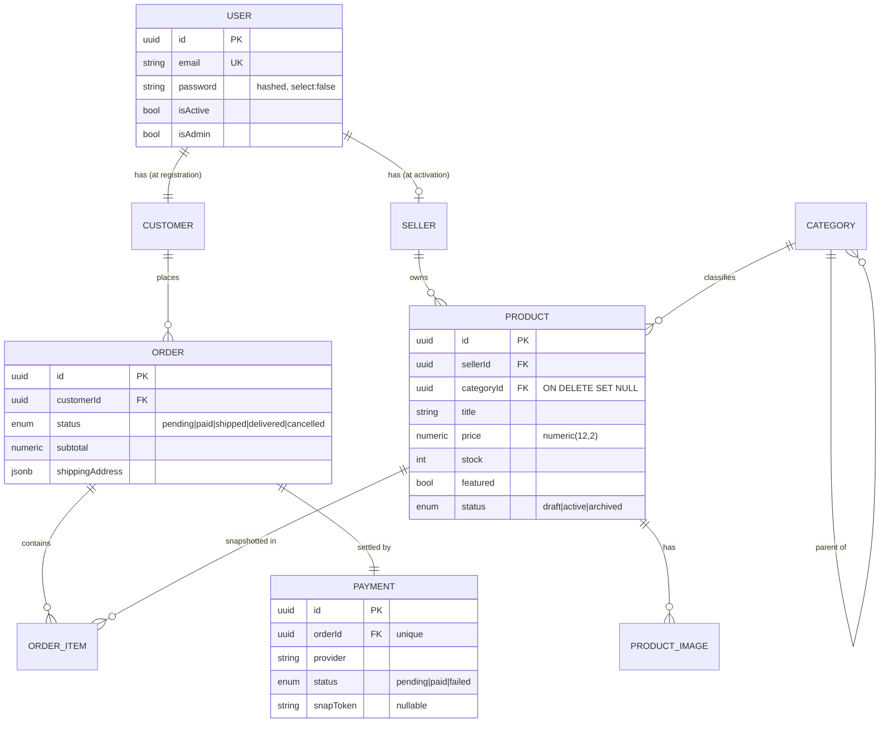

<h1 align="center">Dual-Role Marketplace API</h1>

<p align="center">
  A production-shaped <strong>NestJS</strong> e-commerce backend where every account is a <strong>Customer</strong> by default and can <strong>activate a Seller</strong> profile on demand — with ACID-safe onboarding, JWT role claims, ownership-scoped data access, server-priced checkout, and a pluggable payment gateway.
</p>

<p align="center">
  
  
  
  
  
  
  
  
</p>

---

## What is this project?

This is a full backend API for a two-sided marketplace — think a simplified version of Etsy or Tokopedia. Any registered user is immediately a customer and can browse and buy products. They can also voluntarily activate a seller profile to open their own shop and list products for sale.

The project is built to demonstrate and practise production patterns in NestJS: transactional data integrity, authorization layers, server-side pricing, pessimistic locking, pluggable external services, and clean API design. It is not a toy — the code is organized the same way you would organize a real service you intend to deploy.

**No frontend is included.** This is a pure JSON API ready to back any storefront (Next.js, React Native, Vue, etc.). A companion Next.js storefront is being built separately and connects to this API at port 3000.

---

## Features (implemented)

### Identity and authentication

- **Dual-role model** — one `User` table is the identity source of truth; `Customer` and `Seller` are separate role tables with a unique 1:1 FK back to the user. A user is always a customer and optionally a seller.
- **Transactional registration** — `User` + `Customer` rows are inserted in a single database transaction. If anything fails, both roll back. No orphaned records.
- **Seller activation** — any authenticated user can activate a shop by calling one endpoint. Activation creates the `Seller` row and returns a freshly-issued JWT containing the new `sellerId`, so the client can swap tokens in place with no re-login.
- **JWT with role claims** — tokens carry `customerId`, `sellerId` (null until activation), and `isAdmin`.
- **bcrypt password hashing** at cost 12; the hash column is `select: false` in TypeORM and never returned in responses.
- **Three guard layers** — `JwtAuthGuard` (bearer token), `SellerGuard` (403 if `sellerId` is null), `AdminGuard` (403 if `isAdmin` is false).

### Product catalog

- Full CRUD for sellers, scoped to their own products (ownership enforced at query level, not just application logic).
- `status` enum: `draft` / `active` / `archived`. Only `active` products appear in the public catalog.
- `publish` / `unpublish` endpoints toggle `active` ↔ `draft`.
- `featured` flag for editorial merchandising.
- Full-text search (`?q=`), category filtering with descendant rollup, sort by newest / price.
- **Keyset (cursor) pagination** — O(limit) reads, stable under concurrent inserts.
- Auto-generated URL-safe slugs; stable across renames (`/products/by-slug/:slug`).
- Multi-image support per product: presigned S3/MinIO PUT upload, confirm step, ordering, alt text, dimensions. Public catalog returns a `primaryImage` on list views and full `images[]` on detail views.

### Category tree

- Self-referential parent/child hierarchy (unlimited depth).
- Cycle detection on reparenting.
- Slug auto-generation and uniqueness enforcement.
- Filtering by a parent category automatically includes all descendants (rollup via recursive ID collection).
- Admin-managed; slugs are stable so URL bookmarks survive renames.

### Checkout and orders

- **Server-priced checkout** — item prices are fetched fresh from the catalog at order time; client-submitted prices are discarded.
- **Pessimistic write lock** — rows are locked `FOR UPDATE` inside the checkout transaction to prevent two concurrent orders from overselling the same stock.
- Clear error semantics: `409 Conflict` for out-of-stock items (names the offending product), `400 Bad Request` for non-purchasable products.
- Order item snapshot captures `title`, `unitPrice`, `quantity`, and `lineTotal` at placement time so catalog changes don't retroactively alter order history.
- Order history is paginated and owner-scoped (`customerId` must match the token); a foreign order ID returns 404.
- Status lifecycle: `pending` → `paid` → `shipped` → `delivered` (or `cancelled`).

### Payments

- `PaymentProvider` interface abstracts the gateway. Currently two implementations:
  - **`MockPaymentProvider`** (default, offline) — generates a fake `snapToken`; settlement is triggered by a webhook with a shared-secret header.
  - **`MidtransPaymentProvider`** — creates a real Midtrans Snap session; settlement is triggered by the Midtrans signed webhook.
- Switch between providers with `PAYMENT_PROVIDER=mock` or `PAYMENT_PROVIDER=midtrans` — no code changes.
- **Signature-verified webhooks** — mock verifies `X-Mock-Signature`; Midtrans recomputes `signature_key`. Bad signatures get `401`.
- **Idempotent settlement** — re-delivering a webhook for an already-paid order is a no-op.

### File uploads (avatars and product images)

- Presigned S3/MinIO PUT URLs; the browser uploads directly to the bucket, the backend never proxies file data.
- Two-step confirm flow: the backend records the object key only after the client confirms the upload completed.
- Profile avatars (customers and sellers) and product images follow the same pattern.
- Public GET URLs are also presigned (TTL 3600 s) to work with private buckets, or direct public URLs for seeded fixtures.

### Catalog cache

- Redis-backed list and detail caches for the public catalog.
- Versioned cache keys: mutating a product increments a version counter so stale list pages are instantly invalidated without expensive `FLUSHDB`.
- **Fails open** — if Redis is unavailable, requests fall through to PostgreSQL; no crash, no degraded API.

### Admin panel (API-only)

- Category CRUD (create, rename, reparent, delete with `SET NULL` on products).
- User management: list, deactivate, grant/revoke admin.

### Developer experience

- **OpenAPI / Swagger** auto-generated at `/docs` via `@nestjs/swagger` with the NestJS CLI plugin (DTO schema inference, no manual `@ApiProperty` on most fields).
- **Consistent response envelope** — every endpoint returns `{ status, data }` on success, `{ status, message, errors }` on client error, `{ status, message }` on server error. Applied globally via interceptor + exception filter.
- **TypeORM migrations** manage schema in all environments (`DB_SYNCHRONIZE=false`). Seven migrations from initial schema through seed data.
- E2E smoke test script at `scripts/e2e-verify.mjs`.

---

## Future features (roadmap)

The following features are planned to complete the project into a full end-to-end marketplace.

### Refresh-token rotation and token revocation

**What it is:** Currently tokens are stateless and irrevocable. A user who logs out or changes their password can still use an old token until it expires.

**What needs to be built:**
- A `RefreshToken` table (or Redis set) storing opaque token IDs with expiry.
- `POST /auth/v1/refresh` — accepts a refresh token, issues a new access token + new refresh token (rotation), and invalidates the old refresh token.
- `POST /auth/v1/logout` — adds the current access token's `jti` to a Redis blocklist until its `exp`.
- Update the `JwtAuthGuard` to check the blocklist on every request.
- On password change, invalidate all refresh tokens for the user.

### Order fulfillment lifecycle

**What it is:** After an order is paid, the seller needs to ship it and the customer needs to know when it arrives. Currently the `shipped` and `delivered` statuses exist in the enum but are never set.

**What needs to be built:**
- `PATCH /sellers/v1/orders/:id/ship` — seller marks the order shipped, optionally adding a tracking number and carrier. Requires order's products to belong to the calling seller.
- `PATCH /sellers/v1/orders/:id/deliver` — seller (or a courier webhook) marks delivery confirmed.
- Seller order list view: `GET /sellers/v1/orders` — all orders containing the seller's products, paginated.
- Order detail for sellers: `GET /sellers/v1/orders/:id`.
- Status transition guards: shipping a non-paid order is rejected; delivering a non-shipped order is rejected.
- Email notifications to the customer on each transition (see Notifications below).

### Stock release on payment failure or expiry

**What it is:** When an order is placed, stock is decremented immediately (pessimistic). If payment fails or the order expires unpaid, that stock is never released. Products appear out-of-stock even though the order was never completed.

**What needs to be built:**
- A scheduled job (cron) that runs periodically (e.g., every 5 minutes) and cancels orders that have been in `pending` status longer than a configurable TTL (e.g., 30 minutes).
- Cancellation increments stock back for each `OrderItem` inside a transaction.
- `order.status` and `payment.status` are set to `cancelled` / `failed`.
- Midtrans provides a `expire_time` on the transaction — the job should also handle orders whose Snap token has expired.

### Notifications (email / push)

**What it is:** Customers currently have no way to receive confirmation or updates about their orders.

**What needs to be built:**
- An email service abstraction (`NotificationProvider` interface) — similar to `PaymentProvider`.
- Implementations: SMTP via Nodemailer (dev), SendGrid or AWS SES (production), selectable via `NOTIFICATION_PROVIDER` env var.
- Trigger points:
  - Registration → welcome email.
  - Order placed → order confirmation with line items and total.
  - Order paid → payment confirmation.
  - Order shipped → shipping notification with tracking number.
  - Order delivered → delivery confirmation.
- Email templates (simple HTML, no external template engine required for MVP).

### Reviews and ratings

**What it is:** Buyers who have received an order should be able to leave a star rating and written review on each product.

**What needs to be built:**
- `Review` entity: `id`, `productId`, `customerId`, `orderId` (FK to verify purchase), `rating` (1–5), `body` (nullable text), `createdAt`.
- Uniqueness constraint on `(productId, customerId, orderId)` to prevent duplicate reviews.
- `POST /customers/v1/products/:id/reviews` — authenticated, requires a `delivered` order containing the product.
- `GET /customers/v1/products/:id/reviews` — paginated public list.
- Aggregate `averageRating` and `reviewCount` on the `Product` entity, updated via a database trigger or recomputed on each new review.
- Surface `averageRating` and `reviewCount` in catalog list and detail responses.

### Search improvements (full-text search with PostgreSQL)

**What it is:** The current `?q=` filter uses a `ILIKE '%term%'` which doesn't scale and doesn't rank results by relevance.

**What needs to be built:**
- Add a `tsvector` column to `Product` populated from `title` + `description` via a migration and maintained with a PostgreSQL trigger.
- Switch the catalog `?q=` query to use `@@ to_tsquery(...)` with `ts_rank` ordering.
- `GIN` index on the `tsvector` column.

### Storefront integration (Next.js)

**What it is:** The companion storefront at port 4001 (Next.js) is being built separately. The API is already designed for it (presigned URLs, snapToken/redirectUrl, mock payment redirect flow) but deeper integration work is needed.

**What needs to be built:**
- Cookie-based session handling option (in addition to Bearer tokens) for SSR pages.
- CORS configuration locked to the storefront origin in production.
- `GET /customers/v1/cart/validate` — validates a client-side cart against current stock/price before showing checkout (stateless, no cart persisted server-side).
- Storefront-friendly error codes alongside HTTP status codes so the frontend can show localized messages.

### Seller analytics (basic)

**What it is:** Sellers have no visibility into how their shop is performing.

**What needs to be built:**
- `GET /sellers/v1/analytics/overview` — total revenue, total orders, total units sold for a date range.
- `GET /sellers/v1/analytics/products` — per-product breakdown of revenue and units sold.
- Queries run against the `OrderItem` and `Order` tables (no separate analytics store for MVP).

### Multi-image ordering and cover selection

**What it is:** Product images are ordered by a `position` integer but there is no UI flow to reorder them or explicitly designate a cover image.

**What needs to be built:**
- `PATCH /sellers/v1/products/:id/images/:imageId` — update `position` and `altText`.
- `POST /sellers/v1/products/:id/images/:imageId/set-cover` — swap positions so this image becomes `position: 0`.

---

## Architecture

### Domain model

A single `User` row is the source of truth for authentication. Role-specific data lives in dedicated tables that each own a unique foreign key back to the user.



**Key constraint:** `Product.sellerId` references the `seller` table `id`, not the `user` id. Every ownership check is on `sellerId`. Likewise `Order.customerId` scopes every order read/write to the token holder.

### Module layout

```
src/
├── auth/            decorators, dto, guards (jwt/seller/admin), controller, service
├── users/           entity, admin-users.controller (/admin/users), service
├── customers/       entity, customers.controller (/customers/v1/me + avatar)
├── sellers/         entity, sellers.controller (/sellers/v1 activate + me + logo)
├── products/
│   ├── customer-products.controller.ts   # /customers/v1/products
│   ├── seller-products.controller.ts     # /sellers/v1/products
│   ├── products.service.ts               # keyset pagination + ownership + cache
│   └── product-images.service.ts
├── categories/      admin + customer controllers, categories.service (tree, slug, rollup)
├── orders/          customer-orders.controller, orders.service, entities, dto
├── payments/        payments.controller (webhook), payment.service, providers/
├── storage/         storage.service (presign + publicUrl)
├── cache/           catalog-cache.service (versioned keys, fails open)
├── database/        data-source.ts + migrations/ (7 migrations)
├── common/          filters, interceptors, transformers, slugify, coerce
├── app.module.ts
└── main.ts
```

---

## Technical decisions

### Why NestJS?

NestJS imposes a consistent structure (modules, controllers, services, guards, interceptors) that mirrors how a real team would organize a backend. It makes the code navigable without knowing the project: find the feature folder, find the controller, find the service. It also ships first-class support for everything needed here — JWT, TypeORM, config, Swagger, validation — so the project stays focused on domain logic rather than wiring.

### Why TypeORM over Prisma?

TypeORM was chosen because:

1. **Migrations are first-class and SQL-transparent.** Migration files generate raw SQL that you can read and reason about. With Prisma, migrations are opaque until you inspect the generated SQL separately.
2. **Pessimistic locking.** The checkout flow requires `SELECT ... FOR UPDATE`. TypeORM's `QueryRunner` and `@Lock(LockMode.PESSIMISTIC_WRITE)` make this explicit. Prisma's interactive transactions support raw SQL too, but locking is less idiomatic.
3. **Repository pattern.** TypeORM's generic `Repository<T>` fits naturally in NestJS's DI model. Service constructors inject typed repositories; the compiler catches wrong entity types.

The trade-off: TypeORM has historically had rougher edges and more subtle bugs than Prisma. For a project where migrations and explicit SQL control matter, that trade-off is acceptable.

### Why PostgreSQL?

- ACID transactions are required for ATOMIC registration (User + Customer) and oversell-safe checkout.
- `SELECT ... FOR UPDATE` (pessimistic locking) is needed in checkout.
- `JSONB` columns for `shippingAddress` and `rawResponse` (payment provider payload) avoid maintaining a rigid schema for free-form data.
- Future: `tsvector` / `GIN` index for full-text search on product titles without an external search engine.

### Why keyset pagination over offset pagination?

Offset pagination (`LIMIT n OFFSET m`) requires the database to scan and discard `m` rows on every page. On large catalogs this degrades to O(n). More importantly, if a new product is inserted between page 1 and page 2 being fetched, offset pagination silently skips or duplicates rows.

Keyset pagination uses `WHERE (createdAt, id) < (cursor.createdAt, cursor.id)` to start each page exactly where the last one ended. It is O(limit), stable under concurrent writes, and index-friendly. The trade-off: you can't jump to an arbitrary page number. For a browsable catalog that is acceptable.

### Why presigned URLs for uploads?

Without presigned URLs, every file upload flows through the NestJS process: client → API → S3. The API becomes a file proxy: memory spikes, request timeouts, and no parallelism.

With presigned URLs:
1. Client requests a PUT URL from the API.
2. API signs the URL with S3/MinIO credentials (TTL: 300 s) and returns it.
3. Client uploads directly to the bucket.
4. Client calls the API to confirm the object key.

The API never handles file bytes. It only issues signed intentions and records confirmed object keys.

### Why a confirm step after upload?

Without a confirm step, any client can speculatively obtain a presigned URL and then never upload. The object key is recorded immediately, but the object may not exist. On a confirm call, the backend could optionally HEAD the object to verify it exists before persisting the key. More importantly, it gives the client an explicit success handshake — the object is only associated with the profile/product after the client says so.

### Why a PaymentProvider interface?

The checkout flow is the same regardless of whether the gateway is Midtrans, Stripe, or a mock. Abstracting this behind an interface means:

- During development, `PAYMENT_PROVIDER=mock` eliminates all network dependencies.
- In CI/CD, the mock is used for integration tests with no external credentials.
- Adding a new gateway (Xendit, Stripe) means implementing a 3-method interface and registering it — no changes to `OrdersService` or `PaymentsController`.

The specific interface is: `createPayment(orderId, amount, currency, metadata)` → `{ snapToken, redirectUrl, externalId }`, and `verifyWebhook(headers, body)` → `boolean`.

### Why versioned Redis cache keys?

A simple approach would be `catalog:product:list:<page>`. To invalidate on mutation you'd call `DEL catalog:product:list:*`. But `SCAN`/`KEYS` are slow on large key spaces and block Redis.

Versioned keys work differently:

```
catalog:v:<sellerId>        → current version integer (e.g. 7)
catalog:product:list:7:<cursor>  → the cached page
```

When a seller publishes, updates, or deletes a product, only the version key is incremented. The old page keys expire naturally (TTL). No `FLUSHDB`, no key scanning. Version increment is O(1).

### Why `numeric(12,2)` for prices instead of integer cents?

Both approaches are valid. `numeric(12,2)` was chosen because:

- Prices are displayed as decimals in the API (`1299.99`), and the response should match what users think of as the price.
- Avoiding the mental overhead of "divide by 100 to display" in every consumer.
- TypeORM's `NumericTransformer` ensures the JS `number` type is precise at two decimal places.

The trade-off: arithmetic on `numeric` is slower than on integers. For a marketplace with order volumes that don't require a dedicated billing engine, this is acceptable.

### Why one response envelope?

Clients should not have to write different response-handling logic for different endpoints. A global interceptor wraps every successful response in `{ status: "success", data: ... }` and a global exception filter wraps every error in `{ status: "fail" | "error", message: ..., errors?: [...] }`. The client always knows where to find the payload and where to find error messages.

### Why `DB_SYNCHRONIZE=false` and explicit migrations?

`DB_SYNCHRONIZE=true` compares TypeORM entity definitions to the live schema and applies changes automatically. This is dangerous in production: renaming a column generates a `DROP COLUMN` + `ADD COLUMN`, not an `ALTER COLUMN RENAME`. Explicit migrations are the only safe way to evolve a schema with real data. They are also reviewable in PRs.

---

## API reference

All responses use the standard envelope. Protected routes require `Authorization: Bearer <token>`. Full typed schemas are at **`/docs`** (Swagger).

### Auth — `/auth/v1`

| Method | Endpoint | Auth | Description |
|---|---|---|---|
| `POST` | `/auth/v1/register` | — | Create user + customer (transactional) |
| `POST` | `/auth/v1/login` | — | Return JWT + `expiresIn` (seconds) |

### Customer profile — `/customers/v1/me`

| Method | Endpoint | Auth | Description |
|---|---|---|---|
| `GET` | `/customers/v1/me` | JWT | Read profile |
| `PATCH` | `/customers/v1/me` | JWT | Update profile fields |
| `POST` | `/customers/v1/me/avatar/presign` | JWT | Get presigned PUT URL |
| `POST` | `/customers/v1/me/avatar` | JWT | Confirm uploaded avatar |
| `DELETE` | `/customers/v1/me/avatar` | JWT | Remove avatar |

### Sellers — `/sellers/v1`

| Method | Endpoint | Auth | Description |
|---|---|---|---|
| `POST` | `/sellers/v1/activate` | JWT | Activate shop, return new JWT with `sellerId` |
| `GET` / `PATCH` | `/sellers/v1/me` | JWT + Seller | Read / update shop profile |
| `POST` | `/sellers/v1/me/logo/presign` | JWT + Seller | Presign logo upload |
| `POST` | `/sellers/v1/me/logo` | JWT + Seller | Confirm logo |
| `DELETE` | `/sellers/v1/me/logo` | JWT + Seller | Remove logo |

### Public catalog — `/customers/v1`

| Method | Endpoint | Auth | Description |
|---|---|---|---|
| `GET` | `/customers/v1/products` | — | List active products. Filters: `?categoryId=` (descendant rollup), `?q=`, `?featured=true`, `?sort=newest\|price_asc\|price_desc` |
| `GET` | `/customers/v1/products/:id` | — | Product detail + full `images[]` |
| `GET` | `/customers/v1/products/by-slug/:slug` | — | Product detail by SEO slug |
| `GET` | `/customers/v1/categories` | — | All categories |
| `GET` | `/customers/v1/categories/:id` | — | Category + direct `children[]` |
| `GET` | `/customers/v1/categories/by-slug/:slug` | — | Category by slug |

### Orders — `/customers/v1/orders`

| Method | Endpoint | Auth | Description |
|---|---|---|---|
| `POST` | `/customers/v1/orders` | JWT | Place order (server-priced, oversell-safe). Returns `201` with `payment` object |
| `GET` | `/customers/v1/orders` | JWT | Order history (keyset, owner-scoped) |
| `GET` | `/customers/v1/orders/:id` | JWT | Order detail (`404` if not owned) |

### Payments — `/payments/v1`

| Method | Endpoint | Auth | Description |
|---|---|---|---|
| `POST` | `/payments/v1/webhook` | Provider signature | Settle order idempotently |

### Seller products — `/sellers/v1/products`

| Method | Endpoint | Auth | Description |
|---|---|---|---|
| `GET` | `/sellers/v1/products` | JWT + Seller | List caller's products |
| `POST` | `/sellers/v1/products` | JWT + Seller | Create product |
| `PUT` | `/sellers/v1/products/:id` | JWT + Seller | Update (ownership-scoped) |
| `POST` | `/sellers/v1/products/:id/publish` | JWT + Seller | Set status → active |
| `POST` | `/sellers/v1/products/:id/unpublish` | JWT + Seller | Set status → draft |
| `DELETE` | `/sellers/v1/products/:id` | JWT + Seller | Delete (ownership-scoped) |
| `POST` | `/sellers/v1/products/:id/images/presign` | JWT + Seller | Presign image upload |
| `POST` | `/sellers/v1/products/:id/images` | JWT + Seller | Confirm image |
| `GET` | `/sellers/v1/products/:id/images` | JWT + Seller | List images |
| `DELETE` | `/sellers/v1/products/:id/images/:imageId` | JWT + Seller | Delete image |

### Admin — `/admin`

| Method | Endpoint | Auth | Description |
|---|---|---|---|
| `GET` / `POST` / `PATCH` / `DELETE` | `/admin/categories[/:id]` | JWT + Admin | Full category CRUD |
| `GET` | `/admin/users[/:id]` | JWT + Admin | List / get users |
| `PATCH` | `/admin/users/:id/deactivate` | JWT + Admin | Deactivate account |
| `PATCH` | `/admin/users/:id/role` | JWT + Admin | Grant / revoke admin |

---

## Checkout and payment flow

```
POST /customers/v1/orders
  └─ transaction
       ├─ lock products FOR UPDATE (pessimistic write)   ← prevents oversell
       ├─ re-price from catalog (ignore client prices)
       ├─ validate: active products (400), sufficient stock (409)
       ├─ decrement stock, insert order + order_items
       └─ commit → createPayment(provider) → return 201 { ..., payment }

POST /payments/v1/webhook  (provider → backend, signature-verified)
  └─ on "settlement" → order.status = paid, payment.status = paid  (idempotent)
```

The redirect URL points to the storefront. Settlement is strictly a signed provider-to-backend callback — a browser cannot self-settle an order.

---

## Response format

```jsonc
// Success
{ "status": "success", "data": { /* payload */ } }

// List with cursor pagination
{ "status": "success", "data": { "items": [ /* … */ ], "nextCursor": "eyJ…" | null } }

// Client error (4xx)
{ "status": "fail", "message": "Insufficient stock for product …", "errors": [ "…" ] }

// Server error (5xx)
{ "status": "error", "message": "Internal server error" }
```

---

## Security model

| Concern | Approach |
|---|---|
| Password storage | bcrypt cost 12; hash column is `select: false` |
| Authorization | Three guard layers: JWT, SellerGuard, AdminGuard |
| Ownership | Compound keys in queries — a mismatched owner ID matches zero rows |
| Pricing integrity | Orders re-price from catalog; client-submitted prices discarded |
| Oversell | Products locked `FOR UPDATE` under checkout transaction |
| Webhooks | Mock: shared secret header. Midtrans: recomputed `signature_key` |
| Input validation | Global `ValidationPipe` with `whitelist` + `forbidNonWhitelisted` + `transform` |

---

## Tech stack

| Concern | Technology | Why |
|---|---|---|
| Framework | NestJS 11 | Enforces module/controller/service structure; first-class DI, guards, interceptors |
| Language | TypeScript 5.7 | End-to-end type safety; DTO types drive Swagger schema via CLI plugin |
| ORM | TypeORM 0.3 | Explicit migrations, `FOR UPDATE` locking, repository pattern in DI |
| Database | PostgreSQL 13+ | ACID transactions, `JSONB`, `FOR UPDATE`, future `tsvector` |
| Auth | `@nestjs/jwt` + bcrypt | Stateless JWT, bcrypt at cost 12 |
| Cache | Redis (ioredis) | Versioned catalog cache; fails open |
| Object storage | `@aws-sdk/client-s3` (MinIO-compatible) | Presigned PUT/GET; no file bytes through the API |
| Payments | `midtrans-client` (lazy) + mock provider | Pluggable via interface; offline dev with no credentials |
| Docs | `@nestjs/swagger` + NestJS CLI plugin | Auto-generates OpenAPI schema from DTO classes |
| Validation | class-validator + class-transformer | Declarative DTO validation; strips unknown fields |
| Config | `@nestjs/config` | `.env`-backed config with typed access |
| Testing | Jest + Supertest | Unit + E2E; e2e smoke script against live instance |
| Linting | ESLint + Prettier | `--fix` enforced; runs repo-wide on lint |

---

## Getting started

### Prerequisites

- Node.js 18+
- PostgreSQL 13+ (database must already exist)
- Redis (optional — fails open)
- MinIO or S3 bucket (optional — only for uploads)

### 1. Install

```bash
npm install
```

### 2. Configure

```bash
cp .env.example .env
```

Key variables:

| Variable | Description | Default |
|---|---|---|
| `PORT` | HTTP port | `3000` |
| `DB_HOST` / `DB_PORT` / `DB_NAME` | PostgreSQL | `localhost` / `5432` / `rxzx_db` |
| `DB_USERNAME` / `DB_PASSWORD` | DB credentials | — |
| `JWT_SECRET` / `JWT_EXPIRES_IN` | Token signing | — / `1d` |
| `REDIS_HOST` / `REDIS_PORT` | Redis | `localhost` / `6379` |
| `CACHE_TTL_SECONDS` | Catalog cache TTL | `60` |
| `MINIO_ENDPOINT` / `MINIO_BUCKET` | Object storage | `localhost` / `ecommerce` |
| `MINIO_PUBLIC_URL` | Public base URL for objects | `http://localhost:9000/ecommerce` |
| `PAYMENT_PROVIDER` | `mock` or `midtrans` | `mock` |
| `APP_PUBLIC_URL` | Storefront base URL (mock redirect) | `http://localhost:4001` |
| `MOCK_PAYMENT_SECRET` | Shared secret for mock webhook | — |
| `MIDTRANS_SERVER_KEY` / `MIDTRANS_CLIENT_KEY` | Midtrans (only for `midtrans`) | — |

> The app does not create the database. Run `CREATE DATABASE rxzx_db;` once before migrations.

### 3. Run migrations

```bash
npm run migration:run
```

### 4. Start

```bash
npm run start:dev     # watch mode
npm run start:prod    # from compiled dist/
```

API docs: **`http://localhost:3000/docs`**

### Scripts

```bash
npm run migration:run           # apply all pending migrations
npm run migration:generate -- src/database/migrations/<Name>  # author a new migration
npm run migration:revert        # roll back the latest migration
npm run test                    # unit tests
npm run test:e2e                # end-to-end tests
npm run test:cov                # coverage report
node scripts/e2e-verify.mjs    # live smoke test against a running instance
```

---

## Database migrations

Seven migrations manage the schema in order:

| Migration | What it does |
|---|---|
| `1750377500000-InitialSchema` | User, Customer, Seller, Product tables |
| `1750377600000-CatalogAndProfiles` | Rich product fields (slug, featured, status, images, categories) |
| `1781974024056-ProductCategoryIndex` | Index on `Product.categoryId` |
| `1790000000000-SeedData` | Admin user, test sellers, product fixtures |
| `1790000050000-OrdersAndPayments` | Order, OrderItem, Payment tables |
| `1790000060000-ProductFeatured` | Featured flag backfill |
| `1790000100000-SeedImagesFeaturedBackfill` | Seed featured product images |

---

## License

UNLICENSED — private project.
